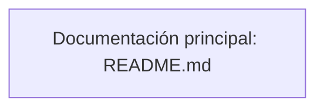

# 1.1 Mapa Mental Narrativo

> Bot de automatización para **Microsoft Dynamics AX** que registra diarios contables automáticamente mediante reconocimiento de imágenes (template matching) y OCR (Tesseract).

## 📊 Diagrama de Arquitectura (Mermaid)



## 📖 Documentación Principal (README)

# Bot AX Contable

Bot de automatización para **Microsoft Dynamics AX** que registra diarios contables automáticamente mediante reconocimiento de imágenes (template matching) y OCR (Tesseract).

---

## 🚀 Requisitos

- **Python 3.12** (o 3.11+)
- **Tesseract OCR** — [Descargar desde UB-Mannheim](https://github.com/UB-Mannheim/tesseract/wiki)
- Dependencias Python: `pip install -r requirements.txt` (PyAutoGUI, pytesseract, Pillow, keyboard)

## 📦 Instalación

```bash
# 1. Clonar o copiar el proyecto
cd ruta/al/proyecto

# 2. Instalar dependencias
pip install -r requirements.txt

# 3. Verificar Tesseract OCR
python scripts/test_ocr.py

# 4. Ejecutar la suite de pruebas (18 pruebas)
python -m pytest

# 5. (Opcional) Verificar que los patrones de imagen se detectan en pantalla
python scripts/diagnose_vision.py
```

> ⚠️ Ejecuta todo con el intérprete del bot (**Python 3.12**). En la máquina de
> producción: `"%LOCALAPPDATA%\Programs\Python\Python312\python.exe" -m pytest`.

Si Tesseract no está en la ruta por defecto, configurar la variable de entorno:

```bash
set TESSERACT_CMD=C:\Ruta\a\tesseract.exe
```

## 🎯 Configuración inicial

Antes del primer uso, definir las áreas de la pantalla donde el bot buscará:

```bash
python -m src.ui.area_selector
```

Esto abre un selector visual. Define en orden:

1. **Sector A** — Área donde están los checkboxes de los diarios
2. **Sector B** — Área donde está el botón "Registrar"
3. **Sector C (Scroll)** — Área donde está la flecha de scroll

Las coordenadas se guardan en `config_sectores.json`.

Ajustar `ocr_region_offset` si los IDs de diario no se leen correctamente (offset desde el centro del checkbox hacia el texto).

> 💡 Copia `config_sectores.json.default` como plantilla si empiezas desde cero.

## ▶️ Uso

### Interfaz gráfica (recomendado)

```bash
python -m src.ui.gui_classic      # GUI clásica (la de uso diario)
python -m src.ui.gui_gemini       # GUI "Gemini Engine"
```

O doble clic en `Lanzar_Bot.bat` (clásica) o `Lanzar_Bot_Registro.bat` (Gemini Engine).

> ℹ️ Los lanzadores comprueban que la unidad `H:` esté disponible y usan la ruta
> fija del proyecto y de Python 3.12. Si el proyecto se mueve a otra unidad o a
> otro PC hay que ajustar esas rutas (mejora pendiente: tarea **C-6** de
> `docs/plans/plan-implementacion-mejoras.md`).

### Panel ACTIONS

| Botón | Función |
|-------|---------|
| Adjust Regions | Abre selector de áreas |
| View Snapshots | Abre carpeta de capturas de error |
| Export Logs | Abre registro del día (`registro_YYYY-MM-DD.txt`) |
| Clear Errors | Resetea contadores y borra `blacklist.json` |
| **Reiniciar** 🆕 | Resetea contadores + borra blacklist + envía **Home** a AX |

### Controles

| Control | Función |
|---------|---------|
| **Start Engine** | Inicia el ciclo de registro |
| **Stop Engine** | Detiene el proceso (vía `stop_event`) |
| **Pause** | Pausa/reanuda el ciclo |

## 🩺 ¿Está trabajando bien el bot?

```bash
python scripts/chequeo_salud.py            # informe legible
python scripts/chequeo_salud.py --json     # para scripts
python scripts/chequeo_salud.py --estricto # exit 1 si hay alertas (cron/CI)
```

O doble clic en `Chequear_Salud_Bot.bat`. Es de **solo lectura**: no toca al bot en
ejecución ni la pantalla, así que se puede usar en cualquier momento.

| Alerta | Qué significa |
|--------|---------------|
| `SESION_TERMINADA_POR_ERROR` | La última sesión murió (crash de PyAutoGUI o timeout extremo) |
| `TELEMETRIA_CONGELADA` | El bot está activo pero `logs/bot_ax.log` quedó atrás de la telemetría |
| `SIN_ACTIVIDAD` | Sesión abierta sin eventos más allá de lo normal (65 min si el bot está esperando el resultado de AX) |
| `TASA_ERROR_ALTA` | Más de 25% de errores en el día |
| `CONFIG_INVALIDA` | `config_sectores.json` o `blacklist.json` ilegibles |
| `SIN_EVIDENCIA` | No hay telemetría ni log que analizar |

## 📋 Formato de logs

```
[14:55:21] . No hay casillas nuevas. Buscando botón de scroll (1/2)...
[14:55:21] . Botón de scroll encontrado. Presionando 5 veces...
[15:07:55] . [2026-06-12] [INFO] Click: Menu @ (1284,104)
[15:07:55] . [2026-06-12] [INFO] Click: Confirmar @ (1154,108)
[15:07:58] . [2026-06-12] [INFO] Esperando resultado (timeout: 60min)...
[15:08:11] . [2026-06-12] [INFO] -> EXITO! (pop-up confirmado)
[15:08:12] + [RESULT:OK] -> Registro de 00328313 completado.
```

- Nombres cortos: `Menu`, `Confirmar`, `Scroll`, `Exito-Ventana`
- IDs normalizados: solo números (`00328313` en vez de `IS00328313Diat`)
- Fecha sin hora duplicada (la hora la pone la GUI)

## ⚙️ Cómo funciona

1. **Busca checkboxes vacíos** en Sector A (`checkbox_vacio.png`, confianza 0.85)
   y procesa solo las filas que están **debajo del último checkbox marcado**
2. **Lee el ID del diario** con OCR (Tesseract) con offset configurable
3. **Filtra**: saltar posiciones ya procesadas y diarios en lista negra (IDs normalizados)
4. **Registra** en AX: clic en checkbox → botón "Registrar" → confirmación
5. **Espera resultado** hasta 60 min (detecta pop-up `msg_exito_asiento_1.png` o `Error_Registro.png`)
6. Al detectar el pop-up de éxito: **1 ESC** para cerrarlo
7. Al detectar error: clic + ESC para cerrar pop-up de error
8. **Persiste** resultado en `registro_YYYY-MM-DD.txt` y errores en `blacklist.json`
9. **Repite** hasta no encontrar más diarios

### Scroll

- Busca `Avanzar_Abajo.png` **solo** en el Sector C (confianza 0.7)
- Si lo encuentra: **1 clic** y espera 1,5 s
- Si no lo encuentra: clic + rueda del mouse en el borde inferior del Sector A;
  si eso falla, tecla `PgDn`. A partir del 2º intento fallido guarda una captura
  (`error_scroll_button_not_found_*.png`)
- Máximo **3 intentos**; al desplazar la pantalla se limpia la caché de
  posiciones procesadas (las coordenadas físicas cambian)

## 🔧 Solución de problemas

| Problema | Causa probable | Solución |
|----------|---------------|----------|
| "Tesseract no encontrado" | Ruta incorrecta | Definir `TESSERACT_CMD` (env var) o instalarlo en la ruta por defecto; el bot ya prueba varias rutas |
| "Sectores no definidos" | `config_sectores.json` ausente | Ejecutar `python -m src.ui.area_selector` |
| No encuentra checkboxes | Confianza muy alta o sector mal definido | Redefinir Sector A con `python -m src.ui.area_selector` |
| Mismos diarios reintentados | OCR variante (`IS` vs `iS` vs `1S`) | El bot normaliza IDs por núcleo numérico |
| Timeout excesivo (1h) | Pop-up no detectado | Verificar `msg_exito_asiento_1.png` en `patrones/` |
| Bot no arranca | El `.bat` no encuentra la unidad `H:` o Python 3.12 | Verificar la conexión a Google Drive y que exista `%LOCALAPPDATA%\Programs\Python\Python312\pythonw.exe` |
| Error `Errno 22` en registro | Ruta relativa o archivo bloqueado | El bot ya usa ruta absoluta + try/except |

## 📁 Estructura del proyecto

```
Bot_AX_Contable/
├── Lanzar_Bot.bat              # Lanzador → GUI clásica
├── Lanzar_Bot_Registro.bat     # Lanzador → GUI Gemini Engine
├── Chequear_Salud_Bot.bat      # Chequeo de salud del bot (solo lectura)
├── src/
│   ├── core/
│   │   ├── engine.py           # Ciclo principal del bot (run_bot)
│   │   ├── config.py           # Carga/validación de sectores + rutas + Tesseract
│   │   ├── logger.py           # Logging con rotación → logs/bot_ax.log
│   │   ├── event_log.py        # Eventos estructurados JSONL → logs/events.jsonl
│   │   └── version.py          # Fuente única de la versión (__version__/VERSION_TAG)
│   ├── services/
│   │   └── vision.py           # Template matching, OCR, capturas de error
│   ├── ui/
│   │   ├── gui_classic.py      # GUI principal (Tkinter)
│   │   ├── gui_gemini.py       # GUI alternativa "Gemini Engine"
│   │   └── area_selector.py    # Calibrador visual de sectores
│   └── bot_ax/config/defaults.py  # Defaults numéricos (offset OCR, confianzas)
├── scripts/
│   ├── observer_analyze.py     # Análisis post-ejecución de logs/registros
│   ├── observer_watch.py       # Vigilancia en vivo (pensado para cron)
│   ├── bump_version.py         # Incrementa src/core/version.py
│   ├── test_ocr.py             # Verificación de Tesseract
│   ├── diagnose_vision.py      # Diagnóstico de detección de patrones
│   ├── debug_ocr.py            # Depuración del OCR de IDs
│   └── debug_pantalla.py       # Captura/resolución de pantalla
├── tests/                      # Suite pytest (18 pruebas)
├── patrones/                   # Imágenes patrón (14 archivos)
├── docs/                       # Manual del proceso, flujo del ciclo, planes
├── requirements.txt            # Dependencias de producción
├── requirements-dev.txt        # Dependencias de desarrollo (pytest, ruff, flake8)
├── config_sectores.json        # Coordenadas de sectores (calibración versionada)
├── config_sectores.json.default
├── blacklist.json              # Diarios con error (auto-generado, no versionado)
├── .githooks/pre-commit        # Auto-bump de versión
├── .context-map/               # Gobernanza de contexto (ContextMap)
└── logs/                       # Logs, eventos y capturas de error
```

## 🔢 Versionado

La versión vive en **`src/core/version.py`** (`__version__ = "00.MM.PP"`). El
pre-commit hook (`.githooks/pre-commit`, activado con `git config core.hooksPath .githooks`)
la incrementa automáticamente según los **archivos** del commit:

| Contenido del commit | Bump | Ejemplo |
|----------------------|------|---------|
| Solo modificaciones de archivos existentes | patch | `v-00.12.00 → v-00.12.01` |
| Algún archivo nuevo o eliminado | minor | `v-00.11.00 → v-00.12.00` |
| `src/core/version.py` ya staged (bump manual) | no toca | — |

Para bumpear manualmente: `python scripts/bump_version.py [patch|minor|major]`

## 🧪 Tests

```bash
python -m pytest          # 18 pruebas: config + normalización de IDs
python -m pytest -v
```

Los dobles inertes de `pyautogui` y `pytesseract` viven en `tests/conftest.py`,
de modo que la suite **nunca** mueve el mouse ni captura la pantalla y puede
correrse mientras el bot está en ejecución.

## 📊 Logs

- **`logs/bot_ax.log`** — Log estructurado con rotación (máx 5MB, 3 backups)
- **`logs/events.jsonl`** — Eventos estructurados (un JSON por línea) para observadores externos: `bot_start`, `checkbox_found`, `menu_click`, `result_exito`, `result_error`, `timeout_*`, `failsafe_triggered`…
- **`registro_YYYY-MM-DD.txt`** — Resumen diario de resultados
- **`blacklist.json`** — IDs normalizados de diarios con error (persistente)
- **`logs/capturas/error_*.png`** — Capturas de pantalla en cada error

## 📜 Historial de cambios

El historial está en [`CHANGELOG.md`](CHANGELOG.md) (formato keep-a-changelog).

## 👤 Autor

José Céspedes — Casino Express / Casino Lo Águila

---
[[1.0-PROPOSITO/1.0-PROPOSITO|⬅ Volver a 1.0 Propósito]]
