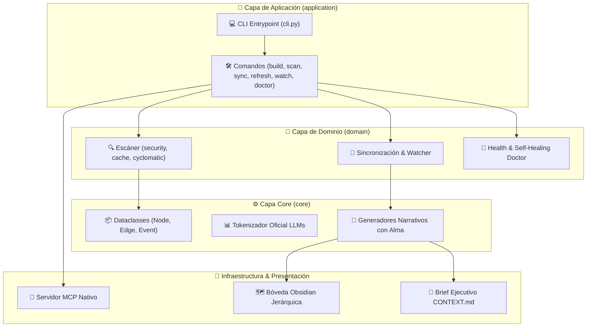

# 3.0 Estructura — Bot_AX_Contable

Componentes base, entrypoints, documentación e identidad del proyecto.

---

## Sub-secciones

- [[3.1-Fundamentos|3.1 Fundamentos]]

---

## 🧜 Diagrama de Arquitectura & Capas del Sistema

---
[[00-INDICE|⬅ Volver al índice]]
