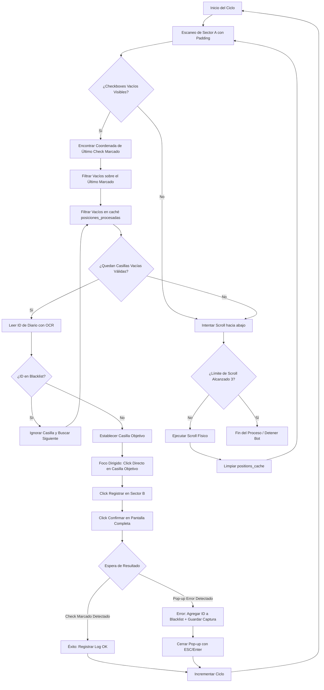

# Manual del Proceso Operativo y Reglas Inmutables del Bot AX Contable

Este documento define la especificación técnica inmutable del proceso lógico, los mecanismos de visión artificial y las reglas de interacción del **Bot AX Contable** con la interfaz de Microsoft Dynamics AX. 

---

## 1. Visión General del Proceso

El bot tiene como objetivo automatizar el registro de diarios contables en Microsoft Dynamics AX mediante técnicas de visión artificial (detección de patrones con OpenCV) y simulación de periféricos (movimiento del cursor, clics y teclado con PyAutoGUI).

La interfaz de Dynamics AX está dividida por el bot en tres zonas de calibración interactiva:
1. **Sector A (Columna de Selección e IDs):** Región de búsqueda de checkboxes vacíos/marcados y lectura del número de diario.
2. **Sector B (Menú de Registro):** Región donde se ubica el botón superior de despliegue de opciones de registro.
3. **Sector Scroll / Sector C (Desplazamiento):** Región del botón de flecha abajo para avanzar a siguientes diarios en la tabla.

---

## 2. Flujo de Ejecución Detallado (Paso a Paso)



---

## 3. Reglas Técnicas e Inmutables de Operación

Cualquier cambio de software en el motor del bot (`src/core/engine.py`) debe respetar estrictamente las siguientes directivas:

### Regla 1: Foco Dirigido No Destructivo (PROHIBICIÓN de Clics Ciegos)
* **El Problema:** Dynamics AX maneja las tablas con selecciones dinámicas. Realizar clics ciegos en cabeceras o en la primera fila de la tabla para "hacer foco" en la aplicación desmarca los diarios procesados previamente, rompiendo la coherencia lógica visual de la tabla y provocando reprocesamiento o colisiones.
* **La Solución:** El bot debe recuperar el foco de Dynamics AX de forma natural e inocua haciendo clic **única y exclusivamente** sobre la coordenada exacta calculada para el checkbox vacío objetivo (`casilla_objetivo`). Si no hay casillas visibles, el foco se recupera interactuando con los elementos de scroll.

### Regla 2: Limitación de Escaneo por Barrera de Último Marcado
* **El Problema:** En Dynamics AX, tras procesar un diario con éxito, este se marca con un checkbox ("usuario marcado"). Para evitar que el bot intente procesar o leer registros superiores que ya fueron procesados en este o anteriores arranques, se debe establecer una barrera dinámica vertical.
* **La Solución:** El bot detecta visualmente todos los checkboxes marcados (`patrones/check_usuario_marcado.png`) con confianza de `0.85`. La coordenada vertical máxima $Y$ encontrada (`ultimo_marcado_y`) actúa como una barrera restrictiva. Cualquier checkbox vacío cuya coordenada $Y \le ultimo_marcado_y$ es automáticamente ignorado por considerarse ya procesado.

### Regla 3: Control de Caché de Pantalla (`posiciones_procesadas`)
* **El Problema:** Para evitar bucles de lectura y falsas detecciones de OCR causadas por micro-desplazamientos de pixeles o fallas visuales, el bot mantiene un set de coordenadas llamadas `posiciones_procesadas`.
* **La Solución:** Las coordenadas de pantalla procesadas se redondean en bloques de 5 pixeles (`coord[0] // 5 * 5, coord[1] // 5 * 5`) para neutralizar fluctuaciones. Si una casilla está en este set, se ignora en la iteración de escaneo de la pantalla actual.

### Regla 4: Limpieza Mandatoria de Caché tras Scroll
* **El Problema:** Cuando el bot ejecuta un scroll hacia abajo, la tabla se desplaza verticalmente. Nuevos diarios suben a la pantalla y toman coordenadas físicas que previamente pertenecían a otros diarios en el set `posiciones_procesadas`. Si no se limpia el set, el bot ignorará los nuevos registros al considerarlos repetidos.
* **La Solución:** Al finalizar físicamente la acción de scroll en pantalla (sea mediante el clic en el botón inferior del Sector C o vía comandos de teclado `Page Down` / `scroll`), se debe ejecutar obligatoriamente `posiciones_procesadas.clear()`.

### Regla 5: Control de Diarios con Error (Lista Negra / `blacklist.json`)
* **El Problema:** Diarios contables que poseen errores de balance u otros fallos duros de validación de negocio en Dynamics AX no pueden registrarse. Si el bot los reintenta de forma continua, se queda atrapado en un bucle infinito en dicho diario.
* **La Solución:** Si al esperar el resultado del registro el bot detecta la pantalla de error (`patrones/Error_Registro.png`), se toman las siguientes acciones de forma automática:
  1. Capturar pantalla completa de error y almacenarla con el ID del diario en la carpeta de capturas de error.
  2. Agregar el identificador de diario normalizado (sin prefijos de caracteres inválidos, solo dígitos) a la lista persistente `blacklist.json` en la raíz.
  3. Cerrar el diálogo del error mediante simulación de `ESC`.
  4. En ciclos futuros, cualquier casilla cuyo ID de diario normalizado coincida con un elemento en la blacklist es omitida en el escaneo inicial, asegurando el avance continuo de la automatización.

### Regla 6: Tolerancia de Detección de Imágenes (Confianza 0.85)
* **El Problema:** Variaciones menores de renderizado tipográfico, compresión de red en escritorios remotos y suavizado de fuentes pueden alterar el match de pixeles de los patrones.
* **La Solución:** La confianza para la búsqueda de checkboxes vacíos (`CHK_VACIO`) y marcados (`CHK_MARCADO`) está fijada en exactamente `0.85`. Valores superiores provocan omisiones de diarios en pantallas con compresión, y valores inferiores provocan falsos positivos (lectura de celdas de texto como si fueran casillas).

---

## 4. Estructura de Persistencia de Resultados

Para asegurar la auditoría de ejecución, el bot genera y mantiene los siguientes recursos durante su operación:

* **`registro_YYYY-MM-DD.txt`:** Creado en la raíz del proyecto. Guarda una traza por cada diario procesado con su timestamp respectivo:
  ```text
  [11:03:15] Diario: 00329981 - Resultado: EXITOSO
  [11:03:29] Diario: 00329982 - Resultado: ERROR
  ```
* **`blacklist.json`:** Archivo JSON en la raíz que almacena la lista de cadenas normalizadas de diarios marcados con error permanente.
* **`capturas/` (o directorio de fallos configurado):** Carpeta donde se graban las capturas de pantalla de fallos de la interfaz con nombres basados en el ID del diario y fecha.
